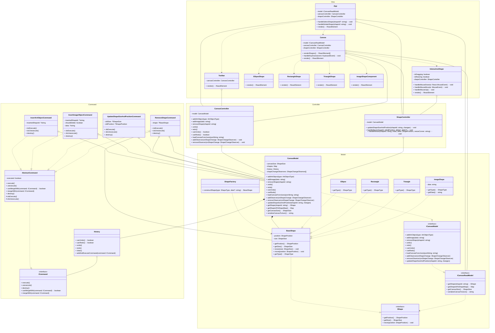

```mermaid
classDiagram

ShapeFactory ..> BaseShape
CanvasModel *-- BaseShape
ICanvasModel ..|> ICanvasReadModel
CanvasModel ..|> ICanvasModel
CanvasModel *-- History
BaseShape ..|> IShape
Ellipse ..|> BaseShape
Rectangle ..|> BaseShape
Triangle ..|> BaseShape
ImageShape ..|> BaseShape
ICanvasReadModel ..> IShape

AbstractCommand ..|> ICommand
InsertArtObjectCommand o-- CanvasModel
InsertArtObjectCommand ..|> AbstractCommand
InsertImageObjectCommand o-- CanvasModel
InsertImageObjectCommand ..|> AbstractCommand
UpdateShapeSizeAndPositionCommand o-- CanvasModel
UpdateShapeSizeAndPositionCommand ..|> AbstractCommand
RemoveShapeCommand o-- CanvasModel
RemoveShapeCommand ..|> AbstractCommand
RemoveShapeCommand o-- BaseShape
RemoveShapeCommand o-- CanvasModel
History o-- ICommand

namespace Command {
    class History {
        + canUndo(): boolean
        + canRedo(): boolean
        + undo()
        + redo()
        + clear()
        + addAndExecuteCommand(command: ICommand)
    }

    class ICommand {
        <<interface>>
        + execute()
	    + unexecute()
	    + destroy()
	    + canMergeWith(command: ICommand): boolean
	    + mergeWith(command: ICommand)
    }

    class AbstractCommand {
        - executed: boolean
        + execute()
	    + unexecute()
	    + canMergeWith(command: ICommand): boolean
	    + mergeWith(command: ICommand)
	    + destroy()*
        # doExecute()*
	    # doUnexecute()*
    }

    class InsertArtObjectCommand {
        - insertedShapeId: ?string
        + doExecute()
	    + doUnexecute()
        + destroy()
    }

    class InsertImageObjectCommand {
        - insertedShapeId: ?string
        - shouldDelete: boolean
        - data: ?string
        + doExecute()
	    + doUnexecute()
        + destroy()
    }

    class UpdateShapeSizeAndPositionCommand {
        - oldSize: ?ShapeSize
        - oldPosition: ?ShapePosition
        + doExecute()
	    + doUnexecute()
        + destroy()
    }

    class RemoveShapeCommand {
        - shape: ?BaseShape
        + doExecute()
	    + doUnexecute()
        + destroy()
    }
}

namespace Model {
    class ShapeFactory {
        + constructShape(type: ShapeType, data?: string): BaseShape
    }

    class ICanvasReadModel {
        <<interface>>
        + getShape(shapeId: string): IShape
        + getShapeIdToShapeMap(): Map<string, IShape>
        + getCanvasSize(): ShapeSize
        + serializeCanvasToJson(): string
    }

    class ICanvasModel {
        <<interface>>
        + addArtObject(type: ArtObjectType)
	    + addImage(data: string)
	    + removeShape(shapeId: string)
	    + undo()
	    + redo()
	    + canUndo()
	    + canRedo()
	    + loadCanvasFromJson(jsonString: string)
	    + addObserver(onShapeChange: ShapeChangeObserver)
	    + removeObserver(onShapeChange: ShapeChangeObserver)
	    + updateShapeSizeAndPosition(shapeId: string, changes)
    }

    class CanvasModel {
        - canvasSize: ShapeSize
        - shapes: Map<string, BaseShape>
        - history: History
        - shapeChangeObservers: ShapeChangeObserver[]
        + addArtObject(type: ArtObjectType)
	    + addImage(data: string)
	    + removeShape(shapeId: string)
	    + undo()
	    + redo()
	    + canUndo()
	    + canRedo()
	    + loadCanvasFromJson(jsonString: string)
	    + addObserver(onShapeChange: ShapeChangeObserver)
	    + removeObserver(onShapeChange: ShapeChangeObserver)
	    + updateShapeSizeAndPosition(shapeId: string, changes)
        + getShape(shapeId: string): IShape
        + getShapeIdToShapeMap(): Map<string, IShape>
        + getCanvasSize(): ShapeSize
        + serializeCanvasToJson(): string
    }

    class IShape {
        <<interface>>
        + getPosition(): ShapePosition
        + getSize(): ShapeSize
        + move(position: ShapePosition): void
    }

    class BaseShape {
        - position: ShapePosition
        - size: ShapeSize
        + getPosition(): ShapePosition
        + getSize(): ShapeSize
        + resize(size: ShapeSize): void
        + move(position: ShapePosition): void
        + getType()*: ShapeType
    }

    class Ellipse {
        + getType(): ShapeType
    }

    class Rectangle {
        + getType(): ShapeType
    }

    class Triangle {
        + getType(): ShapeType
    }

    class ImageShape {
        - data: string
        + getType(): ShapeType
        + getData(): string
    }
}

App o-- ICanvasReadModel
App o-- CanvasController
App o-- ShapeController
App ..> Canvas
App ..> Toolbar
Toolbar o-- CanvasController
Canvas o-- ICanvasReadModel
Canvas o-- ShapeController
Canvas o-- CanvasController
Canvas ..> InteractiveShape
Canvas ..> EllipseShape
Canvas ..> RectangleShape
Canvas ..> TriangleShape
Canvas ..> ImageShapeComponent
InteractiveShape o-- ShapeController
namespace View {
    class App {
        - model: ICanvasReadModel
        - canvasController: CanvasController
        - shapeController: ShapeContoller
        + handleSelectShape(shapeId?: string): void
        + handleDeleteShape(shapeId: string): void
        + render(): ReactElement
    }

    class Canvas {
        - model: ICanvasReadModel
        - canvasController: CanvasController
        - shapeController: ShapeController
        + renderShapes(): ReactElement[]
        + handleKeyDown(event: KeyboardEvent): void
        + render(): ReactElement
    }

    class Toolbar {
        - canvasController: CanvasController
        + render(): ReactElement
    }

    class InteractiveShape {
        - isDragging: boolean
        - isResizing: boolean
        - shapeController: ShapeContoller
        + handleMouseDown(e: React.MouseEvent): void
        + handleMouseMove(e: MouseEvent): void
        + handleMouseUp(): void
        + render(): ReactElement
    }

    class EllipseShape {
        + render(): ReactElement
    }

    class TriangleShape {
        + render(): ReactElement
    }

    class RectangleShape {
        + render(): ReactElement
    }

    class ImageShapeComponent {
        + render(): ReactElement
    }
}

CanvasController o-- CanvasModel
ShapeController o-- CanvasModel
namespace Controller {
    class CanvasController {
        - model: CanvasModel
        + addArtObject(type: ArtObjectType)
        + addImage(data: string)
        + removeShape(shapeId: string)
        + undo()
        + redo()
        + canUndo(): boolean
        + canRedo(): boolean
        + loadCanvasFromJson(jsonString: string)
        + addObserver(onShapeChange: ShapeChangeObserver): void
        + removeObserver(onShapeChange: ShapeChangeObserver): void
    }

    class ShapeController {
        - model: CanvasModel
        + updateShapeSizeAndPosition(shapeId: string, changes): void
        + handleMove(shapeId, initialPosition, deltaX, deltaY): void
        + handleResize(shapeId: string, initial, delta: ShapePosition, resizeCorner: string): void
    }
}
```
